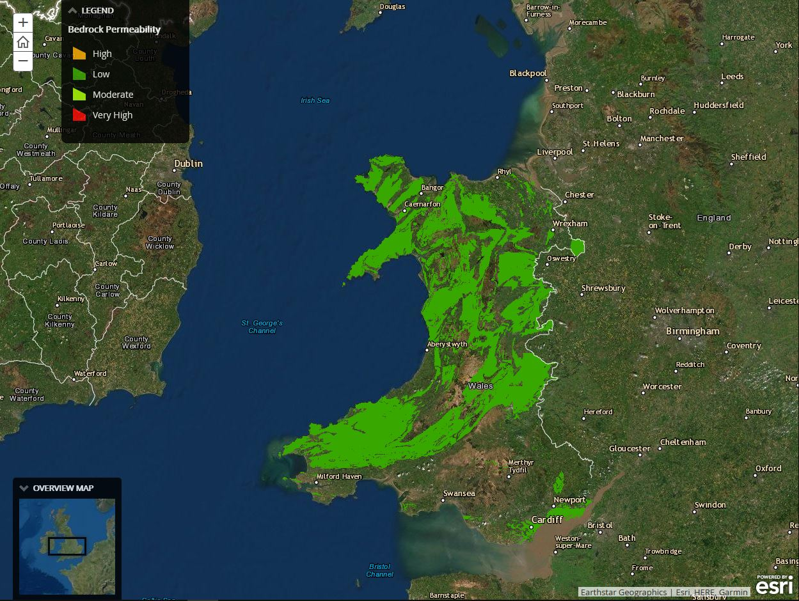

# UK Dam Project
Since the Climate Act of the 2008 policies from the UK Government which was set to reduce CO2 emissions by 80% compared to levels that it was in 1990, the use to renewable energy is essential to achieve this goal. Around the world, many governments want to reduce CO2 emission rate due to climate change. It is essential that any type of renewable sources must be put to actions like hydroelectricity. The project here that is examined within this essay is focusing on the UK energy crisis, by heavily emphasizing on hydroelectricity, and the purpose of this concept that could help UK generate renewable energy without burning CO2 into the air. Hydroelectricity as those do not know is generated by water flowing from high elevations to low elevations. As water flow through a built dam, it is spinning a turbine in which is also spinning an electrons generator that will generate electricity and send it through electric lines across many different places. After the water has flown past this turbine onto the lowest elevation level, it is sent out back into the mainstream and will repeat the water flow cycle. What this project aims to digest is to help UK find suitable locations for hydroelectric dams, specifically focusing on Wales. Since then, UK have been planning in to build more dams across its nation. They have already built multiple so far and continuing to identify more as EA identified 4,112 potential sites that could be part of the development of hydroelectric dams (Environment Agency, 2010).

According to FEMA, dams not only provide renewable energy source, but it also provides longevity in the economic run. With its efficiency rate, reliability, it could also provide employment jobs that could help lower employment rates within the UK. In addition, from positive economic impacts, these dams will create no carbon that will align with UK climate act that was part of the 2008 policies to decrease CO2 emissions. There will be no pollution involve because hydroelectric dams are harmless to the environment. Finally, for the citizens in the UK, dams can be used to prevent heavy floods. It will increase water usage for everyone, that could be use for various thing and sustaining nature in the long run. Remember, hydroelectric power has been generating 1/5th of the world’s electricity (National Geographic, 2016).

The point of this project is to analyze the possibility and examining any negative effects that could unravel as these dams are built. It is not just looking solely only at the geological conditions, but it also involves topographic, hydrological, the distance for energy to travel into the main network, and the environment and social impacts. Knowing that these hydroelectric dams can have such a positive impact, but where it is being built especially on unstable grounds could have a big negative effect in the long run. This project aims to provide as much info as possible for the UK government, and understand any impact these dams could have once they are built. From protected areas, to analyzing settlements, railways, etc. the project wants to include a necessary factor to find a suitable location for the construction of the dam.

Using data from various sources, raster and vector, this project created multiple maps showing different factors in deciding which locations are viable to have the dam built. For example, bedrock permeability obtained from British Geological Survey provided a map showing where low and permeability could be to help determine best dam location. Many areas as show on the map has rather moderate permeability instead of low because low permeability is more suitable than moderate. However, it is not the only one factor in determining the location. Another example is rainfall intensity obtained from Met Office.  The rainfall map shows a high amount of 14mm rain per day around areas between Merthyr Tydfil and Swansea and North of it indicating that these would be some of the best areas for the dams. Other areas, mostly coastal, tends to have low rainfall that would not be suitable as a viable option. Within this project, there are many other factors besides rainfall and bedrock permeability. From slope to Euclidean distance tool, to proximity to settlements, protected areas, substations, and railways, all of this contribute to what they use known as fuzzy logic.  By mapping out each of these factors together, the project combines all these fuzzies layers to calculate an average fuzzy score that would determine the best location to build a dam within Wales. 

Simple enough, the maps presented in this project provides a very easy access for its users. Each highlighted bullet point on the navigation bar presented each factor contributing to the decision of where the dam should be built. Even so, the colors and legends are clearly shown, with a clear indication to what it represents according to the explanation within each pages of the navigation. Each time the user scrolls onto a new page, a new map will show according to the current page the user is on. Within the explanation from each page, there are attached map within the text page to help user understand what the explanation is condoning to help them better understand the concept. The basemap being used is a world topo map, helps indicating high and low elevations of lands. 

What this project did well is the thorough explanation among each page, helping users understand each concept, and why the authors decided to use fuzzy logic as the reasoning in helping them decide the best location for the dam. With pictures, and a small video, it helps the users to be more emerge within the project and develop a sense of curiosity that keep the user scrolling and reading. Even so, the explanation is not much to read, and kept to an efficient minimum that the user does not get bored. There are some attached maps within the text, along with clear indication and clear colors that makes the map easy to read without confusion.
